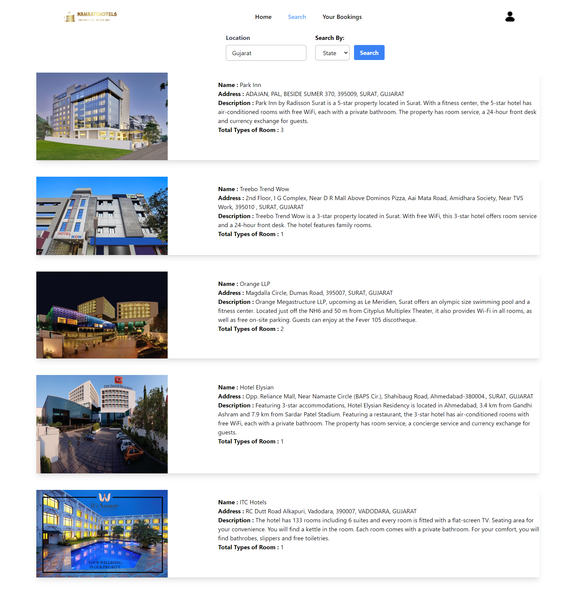
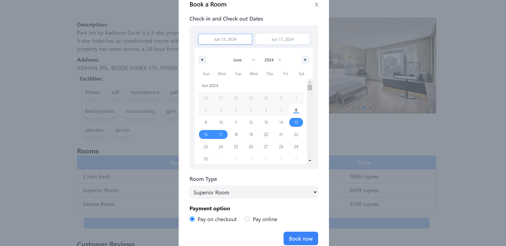
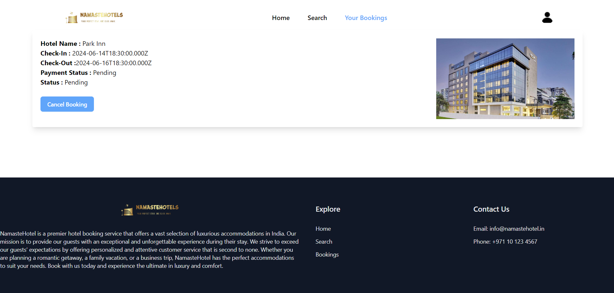

# Hotel Booking Website

  

## 🚀 About the Project

The Hotel Booking Website is a comprehensive platform designed for booking hotels across India. The application features a user-friendly interface, robust backend, and efficient database management to ensure a seamless booking experience for users.

## 🛠️ Technologies Used

### Frontend

- **Next.js**: A React framework for building server-side rendered (SSR) and static web applications.
- **React**: A JavaScript library for building user interfaces.

### Backend

- **Node.js**: A JavaScript runtime built on Chrome's V8 JavaScript engine.
- **Express.js**: A minimal and flexible Node.js web application framework for creating APIs.

### Database

- **MongoDB**: A NoSQL database for storing user and booking data.

## ✨ Features

- **User Authentication**: Secure login and registration functionality.
- **Search and Filter**: Users can search for hotels based on location, price, and ratings.
- **Booking Management**: Users can view, create, and cancel bookings.
- **Responsive Design**: Optimized for both desktop and mobile devices.
- **Payment Gateway**: Integrated with a payment gateway for processing payments securely.

## 📸 Screenshots

### Home Page

### Search Results

### Hotel Booking

### My Booking

